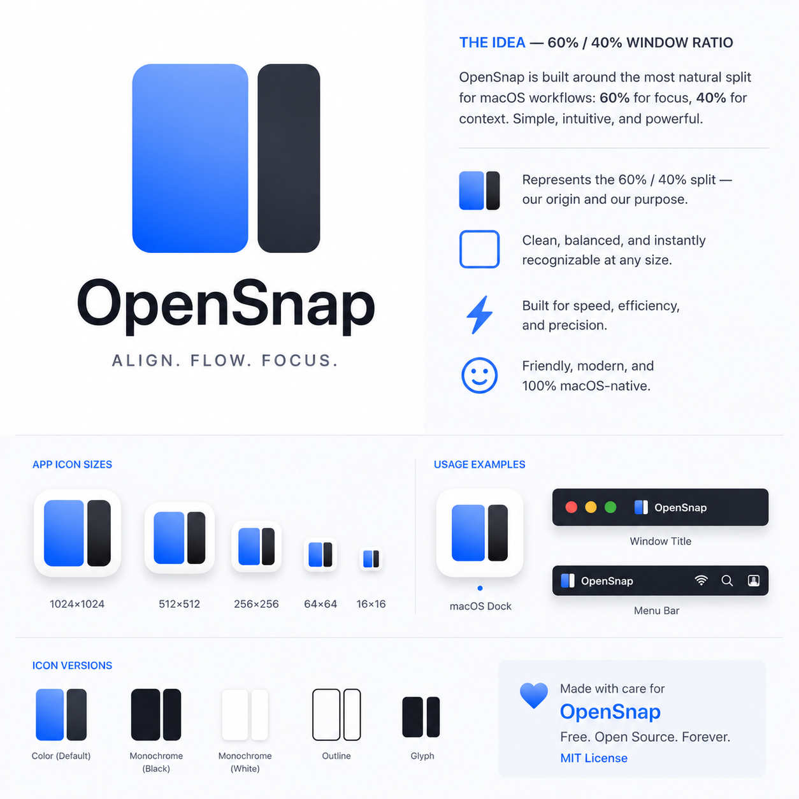

# Brand

This image is the **OpenSnap Brand v1 Reference**. It establishes the current visual direction for OpenSnap.

## Mission

OpenSnap makes macOS window management simple, fast, private, and free.

## Vision

OpenSnap should become the window manager people recommend because it feels obvious the first time they use it and dependable five years later.

## Personality

- Native
- Calm
- Precise
- Friendly
- Fast
- Trustworthy
- Minimal

## Product Positioning

OpenSnap is the native, privacy-first, open-source macOS window manager for people who want fast window control without complexity.

It should feel closer to a thoughtful Apple system utility than a power-user dashboard.

## Values

- Privacy before data
- Reliability before cleverness
- Simplicity before feature count
- Native macOS behavior before custom invention
- Open source forever
- Speed without spectacle

## Voice

OpenSnap speaks plainly. It does not oversell, dramatize, or use jargon when ordinary language is clearer.

Good OpenSnap copy is:

- direct
- short
- helpful
- confident
- human

## Tone

The tone should be calm and precise. When something fails, explain what happened and what the user can do next. When something succeeds, stay quiet unless feedback is useful.
